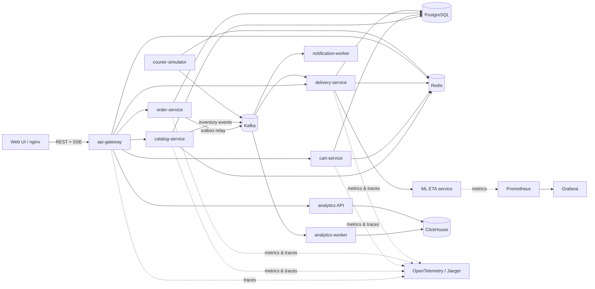

# FreshFlow

FreshFlow — production-like учебная платформа доставки продуктов для демонстрации навыков Go backend и distributed systems. Проект моделирует полный путь заказа: каталог → корзина → резервирование остатков → назначение курьера → real-time доставка → аналитика → сравнение прогнозного и фактического ETA.

Главный принцип: каждая технология решает конкретную эксплуатационную задачу. В проекте нет реальной оплаты, внешних карт, облачных сервисов, OAuth, email или SMS.

## Статус

Базовый план завершён. Поверх него добавлен реалистичный lifecycle доставки: отмена до начала сборки, компенсация товарного резерва, освобождение курьера и SSE-потоки статуса/координат для UI. Go/frontend-тесты, Python syntax/model smoke, сборка и статическая проверка Compose выполнены.

| Этап | Результат | Статус |
|---|---|---|
| 1 | Monorepo, архитектура, границы данных и событий | ✅ |
| 2 | PostgreSQL, Redis, Kafka и базовый Go API в Docker Compose | 🟡 Реализовано; full-stack smoke ожидает доступ к Docker daemon |
| 3 | Каталог, корзина и создание заказа | ✅ код и тесты; full-stack smoke ожидает доступ к Docker daemon |
| 4 | Transactional outbox и Kafka-события | ✅ код и тесты; full-stack smoke ожидает доступ к Docker daemon |
| 5 | Delivery service и courier simulator | ✅ код и тесты; full-stack smoke ожидает доступ к Docker daemon |
| 6 | ClickHouse analytics worker | ✅ код и тесты; full-stack smoke ожидает доступ к Docker daemon |
| 7 | Python/FastAPI ETA service | ✅ baseline, хранение прогнозов и evaluation labels; container smoke ожидает Docker daemon |
| 8 | Prometheus, Grafana, OpenTelemetry и Jaeger | ✅ метрики, dashboard и сквозные traces; container smoke ожидает Docker daemon |
| 9 | Web UI | ✅ каталог, корзина, checkout, live tracking и аналитика; container smoke ожидает Docker daemon |
| 10 | Helm chart и локальный Kubernetes | ✅ chart, local dependencies, migration Jobs, HPA и kind/k3d runbook; cluster smoke зависит от локально установленных Helm/kind/k3d |

## Архитектура



Подробности: [архитектура](docs/architecture.md), [контракты событий](docs/events.md), [локальная разработка](docs/development.md).

## Компоненты и ответственность

| Компонент | Задача | Источник истины |
|---|---|---|
| `api-gateway` | публичный REST API, correlation ID, rate limiting, readiness и reverse proxy | не хранит доменные данные |
| `catalog-service` | товары, цены, остатки, атомарные резервы и освобождение резервов | PostgreSQL; Redis — кеш и TTL-индекс резервов |
| `cart-service` | содержимое корзины и проверка её версии | PostgreSQL; Redis — горячий write-through кеш |
| `order-service` | идемпотентное оформление, состояние заказа, outbox | PostgreSQL |
| `delivery-service` | курьеры, назначение ближайшего свободного курьера, доставка, ETA | PostgreSQL; Redis GEO — текущие координаты |
| `analytics-worker` | идемпотентная проекция событий в аналитические таблицы | ClickHouse |
| `notification-worker` | логируемое mock-уведомление о важных изменениях | PostgreSQL inbox/журнал доставок |
| `courier-simulator` | воспроизводимое движение курьеров и публикация координат | Redis + Kafka |
| `eta-service` | baseline-прогноз ETA через HTTP `POST /predict-eta` | stateless; признаки и результаты сохраняет delivery-service |
| `web` | каталог, корзина, оформление, live-статус, аналитика | backend API |

В локальном окружении сервисы используют один экземпляр PostgreSQL, но разные схемы и отдельных владельцев миграций. Межсервисные запросы не читают чужие таблицы напрямую.

## Основной сценарий

1. UI получает каталог через gateway; catalog-service читает Redis, при промахе — PostgreSQL и обновляет кеш.
2. Cart-service сохраняет корзину в PostgreSQL и обновляет Redis. PostgreSQL остаётся источником истины.
3. `POST /api/v1/orders` требует `Idempotency-Key`. Повтор с тем же ключом и тем же payload возвращает исходный заказ; другой payload даёт `409`.
4. Order-service создаёт запись попытки оформления, затем синхронно запрашивает у catalog-service атомарный резерв.
5. Catalog-service в одной транзакции PostgreSQL блокирует строки остатков, создаёт durable reservation и outbox-событие `inventory.reserved` либо `inventory.reservation_failed`. Redis хранит TTL-индекс для быстрого поиска истёкших резервов, но не является источником истины.
6. После успешного резерва order-service в одной транзакции создаёт заказ `created`, позиции заказа и outbox-событие `order.created`.
7. Outbox relay публикует событие в Kafka как минимум один раз. Consumer-ы дедуплицируют сообщения по `event_id`.
8. Delivery-service выбирает ближайшего доступного курьера по Redis GEO и подтверждает назначение транзакцией PostgreSQL. Конкурирующие назначения защищены блокировкой записи курьера.
9. Courier simulator публикует координаты; delivery-service обновляет live-состояние, а retryable prediction worker вызывает ETA service для каждой новой стадии.
10. Изменения статуса проходят `created → confirmed → assembling → delivering → delivered`. Для `created` и `confirmed` доступна отмена: order-service удерживает блокировку заказа, освобождает reservation и кладёт `order.cancelled` в outbox; delivery-service освобождает назначенного курьера. UI получает статусы и координаты через SSE и закрывает потоки после terminal status.
11. Analytics worker проецирует доменные события в ClickHouse. Стабильный `event_id`, `ReplacingMergeTree` и чтение `FINAL` подавляют эффект повторной Kafka-доставки.
12. Операторский экран показывает fleet и активные назначения. В demo-режиме оператор может добавить 10 секунд к текущей фазе симулятора или завершить доставку; завершение публикует стандартное `delivery.completed` через outbox, поэтому order-service, notifications и analytics видят тот же доменный факт.

Если резерв создан, но заказ не удалось записать, order-service запускает идемпотентную компенсацию освобождения резерва. Периодический reaper также освобождает истёкшие durable-резервы, найденные по Redis TTL-индексу или PostgreSQL fallback-запросу.

## Почему используются эти технологии

- **Go 1.23+** — сетевые сервисы, явная конкурентность, быстрый startup и единый стек backend-компонентов.
- **PostgreSQL** — транзакции, ограничения целостности, блокировки остатков, outbox/inbox и authoritative state.
- **Redis** — низколатентный кеш, горячие корзины, TTL резервов, GEO-координаты и rate limiting. Потеря Redis не должна повреждать доменные данные.
- **Kafka** — развязка delivery, analytics и notifications; replay и горизонтальное масштабирование consumer group.
- **ClickHouse** — дешёвые агрегаты по большому потоку событий без нагрузки на OLTP PostgreSQL.
- **FastAPI** — отдельный контракт и жизненный цикл модели ETA; модель можно обновлять независимо от Go-сервисов.
- **OpenTelemetry + Jaeger** — единый trace оформления заказа через gateway, сервисы, outbox metadata и consumers.
- **Prometheus + Grafana** — SLI сервисов, бизнес-метрики и операционный dashboard.
- **Docker Compose** — быстрый локальный полный стек; **Helm + kind/k3d** — проверка deployment/readiness/HPA без облака.

## Контракты API

Публичный API описан в `contracts/openapi/freshflow.yaml` и доступен через отдельный Swagger UI контейнер.

Планируемый минимальный API:

| Метод | Путь | Назначение |
|---|---|---|
| `GET` | `/api/v1/catalog/products` | каталог с пагинацией |
| `GET` | `/api/v1/carts/{user_id}` | текущая корзина |
| `PUT` | `/api/v1/carts/{user_id}/items/{product_id}` | установить количество товара |
| `DELETE` | `/api/v1/carts/{user_id}/items/{product_id}` | удалить позицию |
| `POST` | `/api/v1/orders` | оформить заказ; требует `Idempotency-Key` |
| `GET` | `/api/v1/orders/{order_id}` | состояние заказа и ETA |
| `DELETE` | `/api/v1/orders/{order_id}` | отменить заказ до начала сборки |
| `GET` | `/api/v1/orders/{order_id}/stream` | SSE-изменения статуса заказа |
| `GET` | `/api/v1/deliveries/order/{order_id}` | назначение, ETA и текущие координаты курьера |
| `GET` | `/api/v1/deliveries/order/{order_id}/stream` | SSE-координаты и состояние доставки |
| `GET` | `/api/v1/operations/couriers` | fleet курьеров и активные назначения для dispatcher UI |
| `POST` | `/api/v1/operations/deliveries/{delivery_id}/actions` | demo-команды `delay` и `complete` |
| `GET` | `/api/v1/analytics/summary` | агрегаты ClickHouse для dashboard |
| `POST` | `/predict-eta` | внутренний API ETA service |

Единый формат ошибки:

```json
{
  "error": {
    "code": "inventory_insufficient",
    "message": "not enough stock for one or more items",
    "details": {"product_ids": ["..."]},
    "correlation_id": "01J..."
  }
}
```

Gateway принимает или генерирует `X-Correlation-ID`. Trace context передаётся стандартным W3C `traceparent`. Логи — JSON с полями `timestamp`, `level`, `service`, `message`, `correlation_id`, `trace_id`, `span_id`, `order_id` и `event_id`, если они применимы.

## События Kafka

Основные topics:

- `freshflow.order.events.v1`: `order.created`, `order.confirmed`, `order.status_changed`;
- `freshflow.inventory.events.v1`: `inventory.reserved`, `inventory.reservation_failed`;
- `freshflow.delivery.events.v1`: `delivery.assigned`, `delivery.completed`;
- `freshflow.courier.location.v1`: `courier.location_updated`.

Сообщения используют версионированный envelope с `event_id`, `event_type`, `event_version`, `occurred_at`, `producer`, `correlation_id`, `trace_id`, `aggregate_id` и `payload`. Kafka обеспечивает at-least-once delivery; exactly-once бизнес-эффект достигается outbox + consumer inbox/deduplication. Полный контракт и ключи partitioning описаны в [docs/events.md](docs/events.md).

На этапе 4 реально публикуются `inventory.reserved`, `inventory.reservation_failed` и `order.created`. Catalog/order записывают неизменяемый envelope в свою outbox-таблицу в той же транзакции, что reservation/order. Relay выбирает pending rows через `FOR UPDATE SKIP LOCKED`, публикует их с aggregate partition key и помечает `published_at`. Сбой между Kafka ack и PostgreSQL commit может дать дубликат — notification-worker подавляет его таблицей `processed_events` в одной транзакции с mock-уведомлением.

На этапе 5 добавлены `courier.location_updated`, `delivery.assigned`, `delivery.status_changed`, `delivery.completed`, `order.confirmed` и `order.status_changed`. Simulator раз в секунду обновляет Redis GEO и Kafka, delivery-service выбирает ближайшего к складу кандидата и атомарно блокирует его строку в PostgreSQL. Симулированная доставка занимает около 15 секунд и проводит заказ через `created → confirmed → assembling → delivering → delivered`.

На этапе 6 analytics-worker читает четыре доменных topic одной consumer group с ручным commit offset только после успешной записи. Он сохраняет логистические факты и денормализованные события заказа, включая массивы товаров. Через gateway доступны общий snapshot и отдельные запросы по часам, ETA, своевременности, отменам, популярным товарам и длительности статусов.

## Хранилища

### PostgreSQL

- `catalog`: products, inventory, inventory_reservations, outbox;
- `cart`: carts, cart_items;
- `orders`: orders, order_items, idempotency_keys, outbox;
- `delivery`: couriers, deliveries, eta_predictions, processed_events;
- `notifications`: notification_log, processed_events.

Каждый сервис применяет только свои миграции. Денежные значения хранятся целым числом минимальных денежных единиц, время — `timestamptz` в UTC, идентификаторы — UUID.

### Redis

- `catalog:product:{id}` — кеш карточки товара;
- `cart:{user_id}` — горячая сериализованная корзина;
- `reservation:expiry:{reservation_id}` — TTL-индекс, дублирующий durable reservation;
- `couriers:geo` — Redis GEO;
- `courier:state:{id}` — текущая позиция/статус с коротким TTL;
- `ratelimit:{route}:{subject}:{window}` — счётчик gateway.

Ключи версионируются префиксом окружения. Операции, критичные для целостности, не полагаются только на Redis.

### ClickHouse

- `delivery_events` — факты назначения, движения, ETA и завершения;
- `order_analytics` — денормализованные события заказа с товарами и переходами статусов.

Обе таблицы используют `ReplacingMergeTree` с ключом `event_id`; dashboard-запросы используют `FINAL`, поэтому повторное Kafka-сообщение не удваивает агрегаты. Готовые SQL: заказы по часам, средний predicted/actual ETA, доля доставок вовремя, отмены, популярные товары и среднее время по статусам — в `db/clickhouse/queries`.

## ETA baseline

`eta-service` использует детерминированную модель `baseline-v1`:

```text
ETA = travel_time(distance, stage)
    + item_handling_time(item_count, stage)
    + district_load_penalty
    + courier_availability_penalty
```

Вход содержит расстояние, количество товаров, стадию заказа, коэффициент нагрузки района и число доступных курьеров. Ответ содержит `predicted_eta_seconds`, версию модели и breakdown факторов. Delivery-service вызывает модель вне транзакции через recovery worker, сохраняет признаки и прогноз в `delivery.eta_predictions`, а после завершения записывает фактическое оставшееся время для каждого прогноза. README ETA-сервиса описывает temporal train/test split, MAE, RMSE, bias и on-time coverage.

## Надёжность и согласованность

- REST mutation endpoints валидируют вход и используют deadline/timeout.
- Idempotency key хранится с hash запроса и готовым ответом в той же доменной транзакции.
- Outbox relay использует `FOR UPDATE SKIP LOCKED`, retry с jitter и маркировку опубликованных записей.
- Consumer сначала резервирует `event_id` в своей таблице `processed_events`, затем применяет бизнес-эффект в одной транзакции.
- Poison messages после ограниченного числа попыток попадут в `.dlq` topic с причиной сбоя.
- PostgreSQL и ClickHouse migrations запускаются отдельной командой/job, а не при конкурентном startup всех replicas.
- `/healthz` проверяет процесс; `/readyz` — критичные зависимости с коротким timeout; `/metrics` отдаёт Prometheus metrics.
- Graceful shutdown прекращает приём трафика, завершает активные запросы и фиксирует Kafka offsets после обработки.

## Observability

Минимальные метрики:

- `http_server_request_duration_seconds` — latency по service/route/method/status;
- `http_server_errors_total` — ошибки без high-cardinality labels;
- `freshflow_orders_created_total`;
- `freshflow_kafka_consumer_lag`;
- `freshflow_eta_prediction_duration_seconds`;
- дополнительные outbox backlog, reservation failures и delivery duration.

Все Go-сервисы публикуют `/metrics`; ETA service предоставляет тот же operational endpoint. Общий middleware измеряет HTTP latency и errors с bounded labels. Order-service считает только успешно committed заказы, Kafka consumers публикуют приблизительный lag после обработанного batch, а delivery/ETA измеряют длительность inference.

OpenTelemetry создаёт server/client spans, передаёт W3C `traceparent` по HTTP и сохраняет `trace_id`/`span_id` в event envelope. Kafka consumer продолжает trace от originating span; delivery хранит исходный context, чтобы stage recovery и ETA HTTP-вызов оставались в trace оформления заказа. Локально spans отправляются OTLP/gRPC напрямую в Jaeger. Correlation ID удобен для пользовательского поиска, trace ID — для причинно-следственного пути. В метриках нет `order_id`, `user_id` и других high-cardinality labels.

Provisioned Grafana dashboard содержит request rate, gateway p95, **5xx-only** availability SLO, число созданных заказов, Kafka lag, ETA p95, on-time delivery ratio и freshness analytics-проекции. Prometheus recording rules и Grafana-managed alerts описаны в [operations guide](docs/operations.md): ожидаемый `404` поиска ещё не назначенной доставки остаётся diagnostic signal, но не расходует availability SLO и не вызывает alert.

## Web UI

Frontend — dependency-free ES module SPA без отдельного клиентского состояния домена: каталог и корзина всегда перечитываются из backend API. Nginx отдаёт статику и проксирует `/api/*` в gateway, поэтому внутренние сервисы не публикуются браузеру и не требуют CORS. Интерфейс включает responsive каталог, server-backed stepper корзины, checkout с уникальным `Idempotency-Key`, timeline заказа, симуляцию положения курьера по реальным координатам ответа и dashboard ClickHouse. Последний открытый order ID хранится локально только для возврата на страницу tracking.

Сгенерированная food-фотография используется как локальный статический asset; внешние CDN, map API и runtime-зависимости отсутствуют. Unit-тесты покрывают форматирование доменных значений и безопасное позиционирование маркера курьера.

## Структура репозитория

```text
freshflow/
├── services/                  # Go-сервисы и workers
│   ├── api-gateway/
│   ├── catalog-service/
│   ├── cart-service/
│   ├── order-service/
│   ├── delivery-service/
│   ├── analytics-worker/
│   ├── notification-worker/
│   └── courier-simulator/
├── pkg/                       # только стабильные cross-cutting Go packages
├── ml/eta-service/            # Python/FastAPI
├── web/                       # frontend
├── contracts/
│   ├── openapi/
│   └── events/
├── db/
│   ├── postgres/migrations/
│   └── clickhouse/migrations/
├── observability/
│   ├── prometheus/
│   ├── grafana/
│   └── otel/
├── deploy/
│   ├── compose/
│   └── helm/freshflow/
├── tests/integration/
├── scripts/
└── docs/
```

Внутри каждого Go-сервиса будет собственный `cmd/<service>/main.go`, `internal/` с transport/application/domain/storage слоями, migrations и Dockerfile. Общая папка `pkg/` предназначена только для действительно стабильных технических контрактов: logging, correlation, tracing, HTTP errors и event envelope. Доменные модели между сервисами не разделяются через Go imports.

## Локальный запуск

Для локального запуска нужны Go 1.23+ и Docker Compose v2:

```bash
make up
make test
make py-test
make web-test
make smoke
make integration
make load
make down
```

Прямые эквиваленты без `make`:

```bash
docker compose up --build -d --wait
go test ./...
$env:PYTHONPATH=(Resolve-Path ml/eta-service).Path; python -m pytest ml/eta-service/tests
node --check web/app.js; node --test web/tests/*.test.js
pwsh -NoProfile -File scripts/smoke.ps1
$env:FRESHFLOW_INTEGRATION=1; go test ./tests/integration -count=1
docker compose down
```

Compose запускает PostgreSQL и его migration job, Redis, Kafka в KRaft-режиме без ZooKeeper, ClickHouse и idempotent DDL job, Go-сервисы, FastAPI ETA service, Prometheus, Grafana, Jaeger, Swagger UI и nginx frontend. `kafka-init` создаёт четыре доменных topic. Web UI доступен на `http://localhost:8089`, gateway — на `http://localhost:8080`, ETA API — на `http://localhost:8090`, Swagger — на `http://localhost:8088`, ClickHouse HTTP — на `http://localhost:8123`, Grafana — на `http://localhost:3000`, Jaeger — на `http://localhost:16686`; `/readyz` проверяет инфраструктуру и readiness всех upstream-сервисов.

## CI и нагрузочный сценарий

Workflow [`.github/workflows/ci.yml`](.github/workflows/ci.yml) запускается для
`main`, pull request и вручную. Он проверяет Go, FastAPI ETA service, frontend,
Compose-конфигурацию, OpenAPI и Helm; затем поднимает весь Compose stack,
выполняет smoke/integration checks и короткий k6 run. При сбое end-to-end job
сохраняет логи Compose как artifact.

Полный локальный k6-сценарий:

```powershell
$env:FRESHFLOW_LOAD_DURATION = '30s'
$env:FRESHFLOW_LOAD_READ_VUS = '8'
docker compose --profile load run --rm k6
```

Он создаёт реальные idempotent-заказы одним serial checkout VU и одновременно
нагружает каталог, аналитику и dispatcher API. Пороги: HTTP failure rate < 3%,
checkout failure rate < 5%, p95 HTTP latency < 1 s. Детали — в
[`load/README.md`](load/README.md).

Демонстрационный пользователь: `00000000-0000-4000-8000-000000000001`. Каталог заполняется пятью товарами миграцией `000002_catalog`.

## Kubernetes

Helm chart находится в `deploy/helm/freshflow`. Он поднимает все application
services и локальные single-node зависимости: PostgreSQL, Redis, Kafka KRaft,
ClickHouse и Jaeger. Отдельные Jobs применяют PostgreSQL/ClickHouse migrations
и создают Kafka topics; `order-service` получает `autoscaling/v2` HPA. Для
browser UI chart оставляет nginx same-origin proxy в gateway, поэтому CORS и
публикация внутренних сервисов не нужны.

Перед install соберите образы и импортируйте их в кластер:

```powershell
kind create cluster --name freshflow
pwsh -NoProfile -File scripts/build-k8s-images.ps1 -Target kind -ClusterName freshflow
helm upgrade --install freshflow deploy/helm/freshflow --namespace freshflow --create-namespace --wait --wait-for-jobs --timeout 8m
kubectl -n freshflow port-forward service/freshflow-freshflow-web 8089:80
```

Полные инструкции, вариант для k3d, проверка templates и очистка — в
`deploy/helm/freshflow/README.md`. Stateful data по умолчанию ephemeral для
воспроизводимой локальной демонстрации; `localDependencies.storage.enabled`
включает PVC. Demo Secret не является настоящим секретом и намеренно не
подходит для production.

## Definition of done

Каждый этап считается завершённым только когда:

1. Реализация запускается documented-командой.
2. Unit/integration tests соответствующего слоя проходят.
3. Для инфраструктуры выполнена проверка конфигурации или smoke test.
4. README и контракты отражают фактическое поведение.
5. В репозитории нет настоящих секретов, внешних платных зависимостей или ложных production-заявлений.
