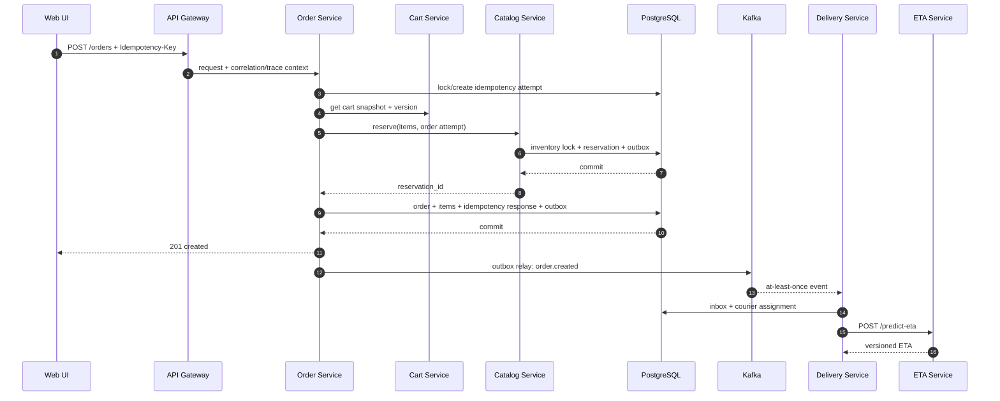

# Архитектура FreshFlow

## 1. Архитектурные цели

FreshFlow оптимизирован не под максимальное число сервисов, а под демонстрацию инженерных решений, которые встречаются в реальной доставке:

- атомарное резервирование ограниченного товара;
- идемпотентное оформление заказа;
- надёжная публикация событий после commit;
- безопасная повторная обработка сообщений;
- быстрое назначение ближайшего курьера;
- отделение OLTP от event analytics;
- сквозная диагностика синхронного и асинхронного пути.

Система принимает eventual consistency между сервисами, но сохраняет строгую согласованность внутри каждого владельца данных.

## 2. Границы сервисов

### api-gateway

Gateway — единственная публичная точка входа для доменного API. Он назначает correlation ID, применяет Redis rate limit, проксирует REST-запросы и унифицирует transport errors. Web-контейнер проксирует браузерный `/api/*` в gateway на том же origin. В gateway нет доменных таблиц и оркестрации долгих саг.

### catalog-service

Владеет продуктами, ценами и остатками. Резервирование выполняется PostgreSQL-транзакцией с блокировкой нужных inventory rows в стабильном порядке, чтобы уменьшить вероятность deadlock. Результат резерва и inventory outbox фиксируются атомарно.

### cart-service

Владеет пользовательской корзиной. PostgreSQL гарантирует восстановление после очистки Redis. Redis ускоряет частые чтения и изменения. Версия корзины защищает checkout от незаметного использования устаревшего содержимого.

### order-service

Оркестрирует короткий checkout: проверяет idempotency key, снимает snapshot корзины, запрашивает резерв и создаёт заказ. Order state machine валидирует переходы. Каждая публикация события начинается с записи в локальный outbox.

### delivery-service

Обрабатывает `order.created`, назначает курьера и управляет delivery state. Redis GEO даёт кандидатов, но окончательная эксклюзивность назначения подтверждается в PostgreSQL. Сервис получает новые координаты, вызывает ETA service и сохраняет прогнозы.

### analytics-worker

Читает все доменные topics одной consumer group и пишет нормализованные строки в ClickHouse. Повторная доставка не должна удваивать аналитические факты: `event_id` входит в ключ дедупликации, а запросы учитывают модель ClickHouse eventual deduplication.

### notification-worker

Реализует внешний side effect в безопасной форме: создаёт запись mock-уведомления и structured log. Таблица inbox защищает от повторного уведомления при redelivery.

### courier-simulator

Создаёт детерминированные маршруты по seed, обновляет Redis GEO и публикует throttled location events. Это позволяет повторять integration/demo сценарии без внешнего map API.

### eta-service

Изолирует контракт inference от реализации модели. Baseline rules engine детерминирован, версионирован и возвращает breakdown. Будущая обученная модель должна сохранить тот же transport contract.

### Observability

Prometheus забирает технические и бизнес-метрики непосредственно с сервисов. Grafana provisioning хранится в Git, поэтому demo-dashboard воспроизводим. OpenTelemetry связывает HTTP client/server spans с асинхронными Kafka consumer spans через context в event envelope; Jaeger хранит и визуализирует локальные traces.

## 3. Checkout saga



### Failure cases

| Сбой | Поведение |
|---|---|
| Один из товаров закончился | catalog rollback; `inventory.reservation_failed`; order не создаётся |
| Ответ reserve потерян после commit | повтор с тем же reservation request ID возвращает сохранённый результат |
| Создание заказа упало после reserve | идемпотентный release; TTL reaper — страховка |
| Процесс order-service умер после commit | outbox relay опубликует событие после рестарта |
| Kafka доставила событие повторно | consumer inbox/`processed_events` подавляет второй бизнес-эффект |
| Redis недоступен | каталог/cart читают PostgreSQL; назначение курьера деградирует до PG fallback; rate limiter fail-open только для локального demo с метрикой |
| ETA service недоступен | назначение и статусы сохраняются; prediction worker повторяет запрос, а readiness delivery-service показывает деградацию |
| ClickHouse недоступен | Kafka offset не фиксируется до успешной записи; lag и retry наблюдаемы |

## 4. Состояния

Order state machine:

```text
created -> confirmed -> assembling -> delivering -> delivered
   |           |            |
   +-----------+------------+-> cancelled
```

`cancelled` терминален. `delivered` терминален. Переходы выполняются compare-and-set обновлением версии заказа и создают `order.status_changed` в той же транзакции.

Delivery state machine:

```text
pending -> assigned -> picked_up -> delivering -> completed
    |          |
    +----------+-> assignment_failed
```

## 5. Модель согласованности

| Данные | Модель |
|---|---|
| Остаток и reservation | строгая транзакция PostgreSQL |
| Заказ и его outbox event | строгая транзакция PostgreSQL |
| Корзина в Redis | eventual cache относительно PostgreSQL |
| Текущие координаты | ephemeral latest-value в Redis; Kafka — история изменений |
| Назначение курьера | PostgreSQL source of truth, Redis — поиск кандидатов |
| Analytics | eventual projection из Kafka |
| UI live status | REST snapshot каждые 1,5 секунды до terminal status |

## 6. Масштабирование

- Stateless HTTP-сервисы масштабируются replicas за Service/load balancer.
- Outbox workers делят работу через `SKIP LOCKED`.
- Kafka consumers масштабируются до числа partitions соответствующего topic.
- Location topic partitioned по `courier_id`, order/delivery topics — по `order_id`, поэтому порядок гарантируется для одного aggregate.
- HPA order-service использует CPU как переносимый baseline; backlog/outbox lag документируется как более полезная будущая custom metric.
- Redis GEO снижает стоимость поиска ближайших курьеров, PostgreSQL защищает от двойного назначения.

## 7. Безопасность локального проекта

- В Git не попадают реальные пароли; `.env.example` содержит только demo defaults.
- Containers запускаются непривилегированными пользователями там, где это поддерживается образом.
- Gateway ограничивает body size и rate, сервисы используют timeouts.
- SQL строится параметризованными запросами.
- OpenAPI фиксирует максимальные длины и диапазоны.
- Internal сервисы не считаются публично доступными в Kubernetes.

## 8. Проверяемость

- Unit tests: state transitions, idempotency decisions, reservation math, ETA baseline, event handlers.
- PostgreSQL integration tests: migrations, concurrent reserve, outbox atomicity, duplicate event processing.
- Kafka integration tests: publish/retry/deduplication и consumer restart.
- End-to-end smoke: seed → cart → checkout → assignment → delivered → ClickHouse query.
- Contract checks: OpenAPI validation и JSON Schema fixtures для событий.
